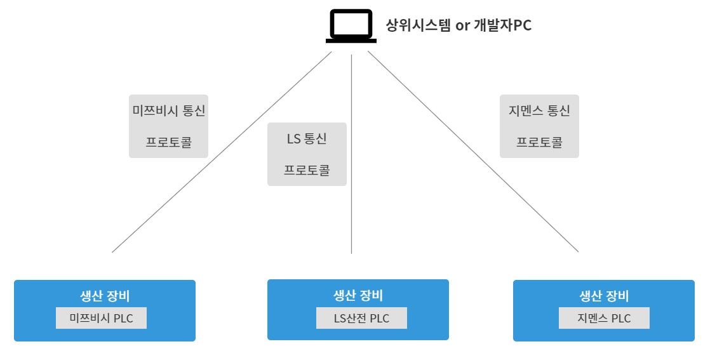

# OPC UA

### 목차

1. OPC란? 
   1.1 OPC 
   1.2 OPC의 목적 
   1.3 OPC의 기능 (서비스) 
   1.4 OPC UA vs OPC DA 
2. OPC UA 
   2.1 OPC UA란 
   2.1 OPC UA의 필요성 
   2.3 상호운용성의 문제점 
   2.4 New Generation OPC를 위한 요구사항 
   2.5 OPC UA 아키텍처 구조 및 구성 요소 
   2.6 OPC UA의 특징 
   2.7 OPC UA의 인더스트리 4.0 활용

 

 

## 1. OPC란?

### 1.1 OPC

* OLE of for Process Contrl의 약자로, 표준화된 통신 프로토콜
  * OLE : 윈도우의 각각의 객체를 응용프로그램에서 다양하게 사용할 수 있는(Object Linking & Embedding) 기능
* OPC Foundation에 의해서 관리되고 있음
* 기존에 약자를 따르는 통신이 OPCDA 즉 OPC Classic -> OPCUA로 발전
  * DCOM으로 통신을 하기 때문에 포트도 지정 되어 있음
  * 외부에서 접속하기에 설정이 까다로움
* DCOM : Distributed Component Object Model의 약자로, 네트워크 컴퓨터 사이에 컴포넌트 간 통신을 위한 마이크로 소프트 기술

 

### 1.2 OPC의 목적

* PLC는 제각가의 프로토콜로 통신 -> PLC의 데이터를 상위시스템으로 인터페이스를 하기 위해서는 PLC 별로 통신 드라이브를 구축해야 함

예) 생산장비 1대에 PLC가 1대가 있는데 그 PLC의 제품이 모두 다르다면 어떻게 될까?

<figure>
    
</figure>

​     -> 각각 다른 통신 프로토콜 별로 통신을 해야 되는 상황이 온다.

      그럼 OPC로 구성하게 되면 어떻게 될까? 

<figure>
	    
</figure>

​     -> 결국 OPC 서버가 프로토콜 통신을 해주면서 서버와 클라이언트 구조로 바뀐것 밖에 없는데 시스템 차원에서 어떠한 이득이 있을까?
​     -> 바로 같은 통신 방법으로 하위에서 상위까지 모두 동일한프로토콜로 통신이 가능

<figure>
	    
</figure>

​         만약 드라이버별로 나누어진 통신 프로토콜을 중국어, 한국어, 영어라고 한다면 서로 의사소통을 하기 힘들것
​         그래서 한가지 언어로 통합해서 의사소통을 하기위해서 OPC를 구성하는 것
​         = 상호운용성을 확보했다라고 표현

* 상호운용성 : 하나의 시스템이 동일 또는 이기종의 다른 시스템과 아무런 제약이 없이 서로 호환되어 사용할 수 있는 성질

 

### 1.3 OPC의 기능 (서비스)

* Classic OPC 표준을 통해 DA(Data Access), AE(Alarm & Events), HDA(Historical Data Access)의 세가지 서버 서비스를 제공

 

* DA : PLC의 현재값을 확인하고 받아올 수 있음. 과거의 데이터는 받지 못함
* HDA : 과거의 데이터를 가져올 수 있음. OPC HDA 서버에서 현재 데이터를 Local Historian에 저장하고 그것을 클라이언트에서 Access함
* AR : 알람 TAG를 등록하면 해당 알림이 True로 바뀌었을 때, 이벤트로 클라이언트에 알려주는 기능

 

### 1.4 OPC UA vs OPC DA

<figure>
    
</figure>

* OPC Classic(OPCDA) : 3개의 서버가 분리되어 있고, 윈도우에서만 동작
* OPC UA : 기존 OPC Classic의 DA/AE/HDA에 Security를 보완해서 크로스 플랫폼으로 제공. 윈도우를 벗어날 수 있게 되었음

 

 

## OPC/UA

### 2.1 OPC/UA란

* Open Platform Communications Unified Architecture의 약자
* 개방형 플랫폼 커뮤니케이션 통합 아키텍처라는 뜻
* 산업용 자동화 어플리케이션 위한 클라이언트/서버 기반 공급자 독립적 통신 프로토콜

 

### 2.2 OPC UA의 필요성

<figure>
	
</figure>

 

<figure>
    
</figure>

* 공장내부 뿐만 아니라, 공장을 초월하여 디바이스부터 엔터프라이즈급 애플리케이션 또는 클라우드의 상호운용성을 확보하기 위함
  * OPC UA를 사용하는 애플리케이션, 플랫폼, 디바이스 들은 서로 쉽게 연결되고 상호간에 제공하는 서비스를 쉽게 이용할 수 있음

 

<figure>
    
</figure>

* 위 그림처럼 스마트 팩토리 환경에서 모든 것(Smart Factory of Things)SFT 들이 모두 OPC UA로 통신하게 되면 가장 하위의 디바이스부터 최상단 어플리케이션까지 __상호운용성이 확보__됨
* 즉 OPC UA라는 표준을 통해서 MES와 ERP라는 애플리케이션이 가장 하단에서 동작 중인 디바이스 또는 설비들을 서비스 형태로 발견 가능하게 되고 그 서비들을 자유롭게 이용하고 활용할 수 있으며 그 반대의 경우도 가능하다는 것
* 결국, 공장 내부뿐만 아니라 공장을 초월하여 제조기업 내의 상호운용성을 확보하기 위해서는 OPC UA라는 표준 도입이 필수적임

 

### 2.3 상호운용성의 문제점

* 상호운용성 : 상호 간에 통신이 가능해지고 정확한 정보 교환이 일어나게 되며 정확한 일련의 처리들이 가능해진다는 것
* 상호운용성을 확보하려면 __애플리케이션이나 플랫폼이 동작하는 컴퓨터의 운영체제에 종속적이거나 디바이스(설비) 제조사에 의존적이면 안 되는__ 상황이었으나 OPC는 그러지 않았음

<figure>
    
</figure>

 

* Classic OPC의 문제점
  * 윈도우 운영체제에 종속적이다.
  * 보안이 취약하며 성능적인 면에서 버려야 할 기능들을 포함하고 있다.
  * 데이터 접근, 데이터 접근 히스토리, 알람 및 이벤트 등 분리된 아키텍처를 가지고 있다.

<figure>
    
</figure>

 

###  2.4 New Generation OPC를 위한 요구사항

운영체제에 의존적이지 않고 설비 제조사에 의존적이지 않은 __상호운용성 확보__를 위한 표준을 만들기 위해 OPC 재단이 제조 분야의 다양한 기업들로부터 새로운 요구사항을 수집함

<figure>
    
</figure>

* 공장 내 뿐만 아니라 공장 외적으로도 다양한 애플리케이션들이 서로 커뮤니케이션 하는 경우가 많음
  * 이를 위해서는 네트워크 인프라에 너무 의존적이지 않은 성능 이슈가 해결돼야 함
  * 인터넷 방화벽을 통해 보안이 강화된 접근 및 제어를 해야함
* 통신 중 사라지거나 저장된 데이터들의 신속한 복구 등을 위해 이중화(중복성) 개념이 반드시 적용되어야 했음
  * 이렇게 되려면 견고한 장애도 신속하게 회복시킬 수 있어야 함
* 확장적인 측면으로는 계층적으로 볼 때 최하위 디바이스부터 SCADA를 거쳐 MES, ERP 등과 같은 애플리케이션까지 모두 서비스 형태로 이용할 수 있어야 함
* 서비스 형태로 서로가 서로를 이용하기 위해서는 서비스의 내용들이 데이터 모델링이 되어야함
* 디바이스부터 애플리케이션까지 자기가 제공하는 서비스에 대해서 데이터, 메소드, 이벤트 등을 쉽게 정의할 수 있어야함

 

<figure>
    
</figure>

 

### 2.5 OPC 아키텍처 구조 및 구성 요소

<figure>
    
</figure>

* Transport : 전송과 관련된 이슈들을 1차적으로 해결해야 했음
  * 웹 서비스 개념을 차용해 플랫폼 독립성 이슈 해결
  * TCP를 사용하여 인터넷 방화벽을 통한 보안 접근 및 제어가 가능하도록 함
* OPC UA Meta Model : 서로에게 서비스 형태로 제공되어야 하는 부분들을 모델링 하는 기본 규칙과 제약사항에 대해서 정의함

 

<figure>
    
</figure>

* OPC UA Information Model : 모든 OPC 데이터를 위한 공통 모델을 제공하는 부분
  * DA (Data Access) : 아날로그 데이터나 이산 데이터 모델링과 같은 특정 자동화 데이터의 확장성과 관련된 부분들 정의
  * AC (Alarm & Conditions) : 공정 프로세스 알람 및 조건 모니터링을 위한 고급 모델 명시
  * HA (Historical Access) : 시간 순서대로 데이터와 이벤트 등에 접근 가능하도록 하는 메커니즘 정의
  * Prog (Programs) : 프로그램 실행 등과 관련된 부분들을 시작하고 조작하며 모니터링할 수 있는 메커니즘을 명시

 

* Specifications of Information Models of other Organizatios (다른 기관(조직)의 정보 모델 명세)
  * 데이터 모델링 관련 요구 사항 중에서 '다른 표준 데이터 모델을 위한 토대'와 관련된 부분을 해결한 곳
  * ex. IEC, EDDL FDT, PLCopen 등

 

### 2.6 OPC UA의 특징

1. 벤더 독립적 : 특정 벤더에 종속되지 않아 범용적 사용
2. 상호간 제어 : 양방향 제어가 가능한 통신 프로토콜
3. 다양한 I/F : 여러 시스템 호환 다양한 I/F 구현 가능

 

### 2.7 OPC UA의 인더스트리 4.0 활용

1. 다중 벤더, 다중 플랫폼 기반 신뢰성 있는 정보/데이터 전달 
2. 고가용성, 고확장성, 아키텍처 기반 고품질 서비스
3. 타 분야 통합을 통한 산업 자동화

 

 

#### 출처

1. OPC UA 통신 쉽게 알기 : [링크](https://red-nose-cousin.tistory.com/2?category=874877)
2. OPC UA 개념 : [링크](https://blog.naver.com/eva0191/222130828160)
3. OPC/UA (Unified Architecture) : [링크](http://blog.skby.net/opc-ua-unified-architecture/)